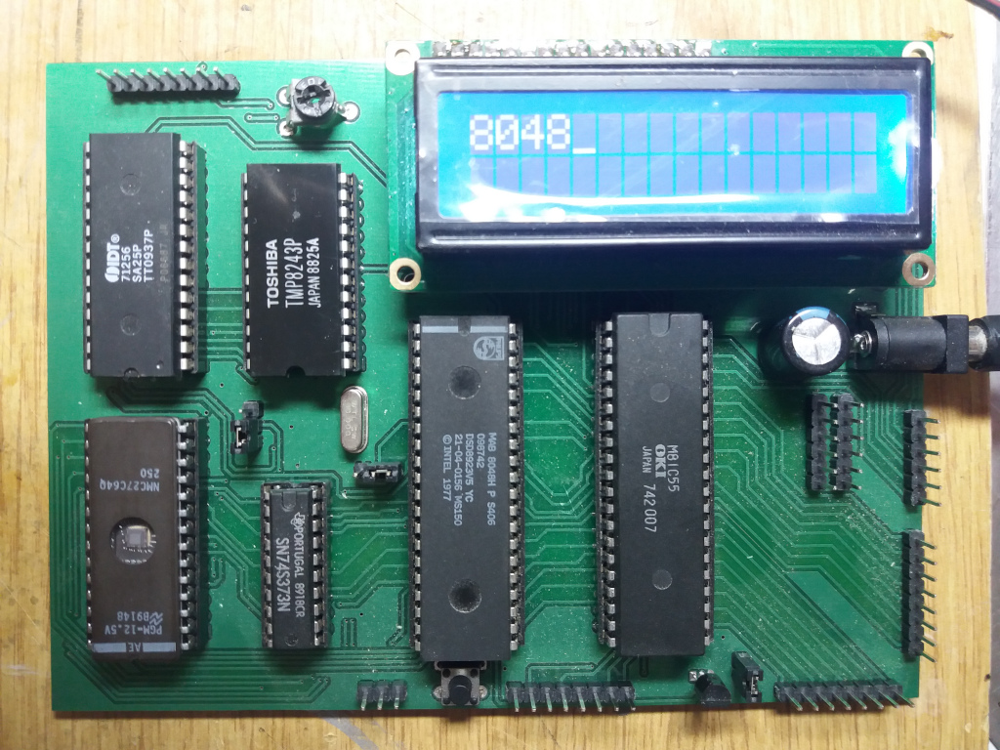

# MCS-48_asm_examples

This repository contains example assembly code for the MCS-48 family microcontrollers. The firmware was tested on the MCS-48_ev_kit available on zaquadnik's github. The firmware examples are kept in separate directories. Below there are brief descriptions of them. 

The compilers/IDEs used for building the code:

1. [MCS-48 IDE][a1] - old IDE, similar to Turbo Pascal's. It contains also MCU emulator. Requires DOSbox to run.
2. [RainbowIDE][a2] - among many assemblers for old computers & CPUs it contains MCS-48 assembler. Very nice, modern IDE.
3. [ASM48][a3] - open assembler for MCS-48. Available with the source code also on my github (fork of original repo). Can be compiled for Linux.
4. [Avocet simulator for Intel 8048][a6] - simulation tool for MCS-48. Very useful because there is no JTAG in MCS-48. DOS-based, thus requires DOSbox to run.

I've also found some tools for the MCS-48 family on [Web Archive][a4].

## Project_template
This is "skeleton" code for your own project. It contains the entry points for reset and both interrupts available on the MCS-48 family.

## LCD_HD44780_example
This is example assembly program to run the HD44780 alphanumeric LCD. Program was ran using [MCS-48 EVK][a5] available on my github. The program was written based on the template above. LCD uses 4-bit mode. The result is shown below.

The LCD is connected to the following pins of 8048 microcontroller:

* LCD D4 - 8048 P1.0
* LCD D5 - 8048 P1.1
* LCD D6 - 8048 P1.2
* LCD D7 - 8048 P1.3
* LCD E  - 8048 P1.4
* LCD RS - 8048 P1.5

RW pin of LCD is connected to GND. There are no reads from the LCD's controller. The control is based on delay loops.

[a1]: https://web.archive.org/web/20081122034504/http://www.armory.com/~rstevew/Public/Micros/8048/8048IDE/
[a2]: http://www.cococommunity.net/product/rainbow-ide/
[a3]: https://daveho.github.io/asm48/
[a4]: https://web.archive.org/web/20120204055551/http://www.armory.com/~rstevew/Public/Micros/8048/
[a5]: https://github.com/zaquadnik/MCS-48_EVB
[a6]: https://www.qrz.ru/software/detail/avocet_simulator_for_intel_8048_disasm_280
